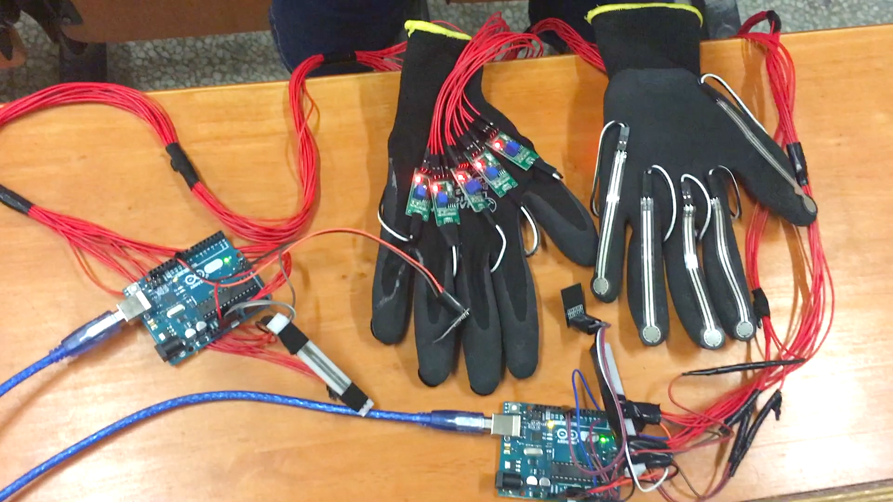
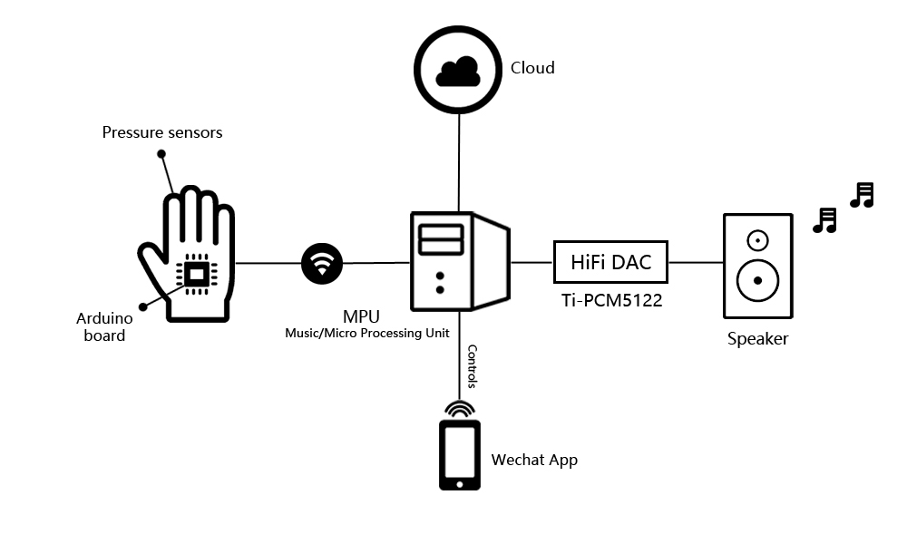

# MusicGloves

    

Check this vedio out for the information of our music gloves!

## Brief Introduction
  Traditional music instruments like the piano, the guitar, etc. all have their own features and rules that can be barriers when you try to learn them. You need to have a good command of them first before you can play a beautiful stream of music. Then it came to us that why not build a new kind of instruments that can befriend people even at age of 6 and arouse their interests for creating music. And here we have this glove. Just wear them and music will come out with just simply tapping on any surface.
 
  You can play the piano, the guitar either by single-note or by chord, you can even play the theme music of Mission Impossible by just memorizing a few sets of combinations of tapping.

## System Information

    

  There are pressure sensors on the finger tips, transmitting the tapping information to the Arduino board which then passes it through wifi to the MPU. We call it Micro or Music Processing Unit, because all the processing, control and music playing are implemented on this MPU. I can change its mode by an app, record my music on its memory chip or upload it onto the cloud, or just let it play real-time.

## Code Information

  Our code consists of two parts.

  In the first folder *ArduinoGlove* is the code implemented on the chips of gloves. The main function of this code includes collecting information from the sencors on the finger tips, briefly processing the data, constructing connection between the glove and the server, transmitting the information. With all parameters adjusted, it works well with natrual gestures of playing.

  In the second folder *RaspberryServer* is the code implemented on the Raspberry Pi - the server. The code includes various funtions including receiving and processing the data from gloves and ensuring the connection among gloves, the server and the smartphone used to change playing mode. The main function code file is *server.py*, with the rest of them used as tests and demos.

  The whole system requires a local area network with a router set initially.

